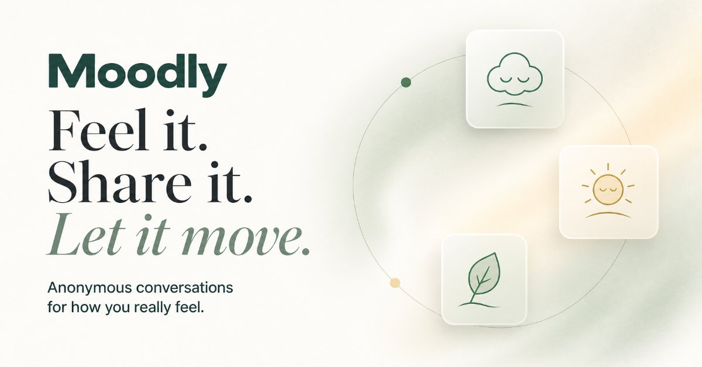

<p align="center">
  
</p>

<h1 align="center">myMoodly</h1>

<p align="center">
  <strong>Name how you feel. Talk it through with one real person.</strong><br>
  An anonymous, mood-matched peer conversation platform for adults.
</p>

<p align="center">
  <a href="https://mymoodly.space">mymoodly.space</a> ·
  <a href="docs/API.md">API reference</a> ·
  <a href="https://mymoodly.space/privacy">Privacy</a> ·
  <a href="https://mymoodly.space/terms">Terms</a>
</p>

---

## Overview

myMoodly connects two strangers by how they feel, not who they are. A person
places a light on a mood map, picks the word that fits, and is matched with
someone in a similar headspace or a different one. They talk anonymously for
20 minutes, then reflect on how they feel afterwards.

There are no profiles to browse, no followers and no history anyone else can
see. Each person appears under a rotating two-word name such as "Quiet Heron".

myMoodly is peer support, not therapy or a crisis service. Support lines are
one tap away on every screen.

## Features

**Check-in**
- A two-dimensional mood map (energy × pleasantness) with keyboard support
  and a four-area fallback
- A short list of feeling words for the chosen area, from gentle to strong
- An optional note for the other person, and a choice between someone who
  feels similar or someone in a different headspace

**Matching and conversation**
- Real-time matching by mood and shared language, with an option to widen
  the search after a minute
- Live one-to-one chat over WebSocket with a 20-minute timer, extendable when
  both people agree
- A closing reflection with a before/after mood map and a short survey, then
  a one-tap path to the next conversation

**Safety**
- Report and block in every conversation; three distinct reports lead to a
  permanent ban
- Server-side message moderation in three levels: clearly harmful messages
  (threats, harassment, slurs) are blocked, borderline ones are delivered with
  a gentle warning and a report option, and everything else passes through.
  People describing their own pain are never blocked.
- Check-in notes can't contain contact details or harmful language
- 18+ only, with a daily limit of 10 conversations

**Experience**
- "Sanctuary" backgrounds: illustrated dawn, day, golden-hour and night scenes
  that follow the local time of day, with light and dark themes
- Optional generated ambient sound per scene
- Built for phones first, with reduced-motion support

## How it works

```
Browser (Next.js client)
   │  HTTPS /api/*                         WebSocket /api/realtime
   ▼                                              ▼
Cloudflare Worker ── session check ──┬── App API routes ──────────┐
                                     ├── Matchmaker (Durable Object, one global queue)
                                     └── ChatRoom   (Durable Object, one per conversation)
                                                                  ▼
                                                     Cloudflare D1 (SQLite)
External: Google OAuth (sign-in) · Gmail SMTP (admin alerts)
```

- The **Worker** resolves the signed-in user from a hashed session cookie and
  routes each request.
- The **Matchmaker** Durable Object owns the waiting queue, so two people can
  never be matched into two conversations at once.
- Each **ChatRoom** Durable Object runs one conversation: it checks
  membership, moderates and stores messages, and ends the chat on a
  server-side alarm.
- **D1** holds profiles, check-ins, conversations, messages, reports and
  analytics.

See [docs/API.md](docs/API.md) for every route, request and response.

## Tech stack

| Area | Technology |
|---|---|
| Frontend | Next.js 16 (App Router), React 19, Framer Motion, plain CSS |
| Runtime | Cloudflare Workers via [vinext](https://github.com/cloudflare/vinext) |
| Realtime | Cloudflare Durable Objects, WebSockets |
| Database | Cloudflare D1 with Drizzle ORM |
| Auth | Google OAuth 2.0 (PKCE, nonce, state), hashed session tokens |
| Email | Gmail SMTP for admin alerts |
| CI/CD | GitHub Actions: lint, build, test, deploy on every push to `main` |

## Project structure

```
app/
  MoodlyApp.tsx          Client orchestrator: screens, navigation, realtime
  components/moodly/     UI: landing, check-in, waiting room, chat, reflection
  styles/moodly/         Design tokens and component styles
  api/                   API routes: profile and check-ins, auth, admin
  lib/                   Shared helpers (routes, profile, contact-detail check)
worker/
  index.ts               Worker entry: routing and session check
  realtime.ts            Matchmaker and ChatRoom Durable Objects
  harmfulLanguage.ts     Message moderation
db/                      Drizzle schema and D1 access
drizzle/                 Database migrations
tests/                   Unit, integration and load tests
docs/API.md              API reference
```

## Getting started

**Requirements:** Node.js 22.13 or later.

```bash
npm install
cp .dev.vars.example .dev.vars   # then fill in the values
npm run dev                      # http://localhost:3000
```

`.dev.vars` holds local secrets and is ignored by Git:

| Variable | Used for |
|---|---|
| `GOOGLE_CLIENT_ID`, `GOOGLE_CLIENT_SECRET` | Google sign-in |
| `SMTP_USERNAME`, `GMAIL_APP_PASSWORD` | Sending admin alert emails |

The local server uses its own local D1 database, so development never touches
production data. On `localhost` only, API requests may pass an `email` field
in place of a session, which lets the integration tests simulate users.

## Testing

```bash
npm test          # build, then unit tests (moderation, contact details, rendering)
npm run lint
```

With the local server running, the integration and load tests exercise real
matching and chat:

```bash
MOODLY_BASE_URL=http://localhost:3000 node tests/realtime-integration.mjs
MOODLY_BASE_URL=http://localhost:3000 node tests/language-matching.mjs
MOODLY_BASE_URL=http://localhost:3000 node tests/matchmaking-50-users.mjs
```

## Deployment

Every push to `main` runs the [Deploy workflow](.github/workflows/deploy.yml):
lint, build and tests, then `wrangler deploy` to Cloudflare Workers. A failing
step stops the deploy, so the live site only changes when everything passes.

Production secrets are stored in Cloudflare, not in this repository.

### Optional scene recordings

Ambient sound is generated in the browser by default. To use real recordings
instead, add looping audio files at `public/sounds/dawn-lake.mp3`,
`day-meadow.mp3`, `golden-shore.mp3` and `night-aurora.mp3`; they're picked up
automatically. Use only audio you have the rights to.

## Blog

The blog lives at [/blog](https://mymoodly.space/blog). Posts are typed data,
not HTML, so they can't inject markup.

**Adding a post:** create a file in `app/blog/posts/` (copy an existing one),
then register it in `ALL_POSTS` in `app/blog/lib/posts.ts`. The index, sitemap
(`/sitemap.xml`) and RSS feed (`/blog/feed.xml`) pick it up automatically.
Body text supports `**bold**`, `*italic*` and `[links](https://…)`. Cite
sources for any health claim, and set `adsAllowed: false` on posts about
crisis, self-harm or grief.

**Ads:** slots are built in but off. See `app/blog/lib/ads.ts` for the
placement rules and the switch, and add `?ads=preview` to any blog URL to see
where they sit. Update the Privacy Policy before turning them on.

## Privacy and safety

- Conversation partners see only each other's rotating name. Report and block
  resolve the other person on the server; real identities never reach the
  client.
- Session tokens and sign-in codes are stored only as hashes.
- Messages and check-ins are stored to deliver conversations and to run
  safety, reporting and abuse controls, as described in the
  [Privacy Policy](https://mymoodly.space/privacy).

If you find a security issue, please report it privately to the project
owner instead of opening a public issue.

## Status

myMoodly is in active development and early launch.

© myMoodly. All rights reserved.
